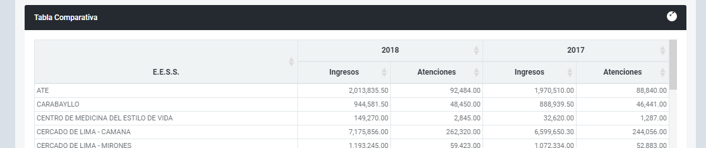
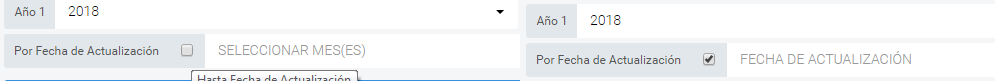

## RES-ONLINE V 2.7.1
Repotes de Operaciones

>ChangeLog:

* SE AGREGÓ EL NÚMERO DE ATENCIONES EN LA TABLA COMPARATIVA RESULTADO DEL RESUMEN DE OPERACIONES. (PARA CENTRO, MESES Y ESPECIALIDADES).

<<<<<<< HEAD
* SE CAMBIO EL LABEL DEL CHECKBOX DE *"MES" a *"POR FECHA DE ACTUALIZACION"*

=======
* SE CAMBIO EL LABEL DEL CHECKBOX DE *"MES" a *"POR FECHA DE ACTUALIZACION"
>>>>>>> 340e9db6f7922c8a12859efb12f7b9d124fa9c35
