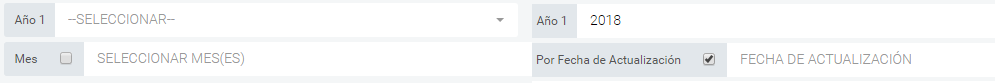

## RES-ONLINE V 2.7.1
Repotes de Operaciones

>ChangeLog:

* SE AGREGÓ EL NÚMERO DE ATENCIONES EN LA TABLA COMPARATIVA RESULTADO DEL RESUMEN DE OPERACIONES. (PARA CENTRO, MESES Y ESPECIALIDADES).

* SE CAMBIO EL LABEL DEL CHECKBOX DE *"MES"* a *"POR FECHA DE ACTUALIZACION"*

